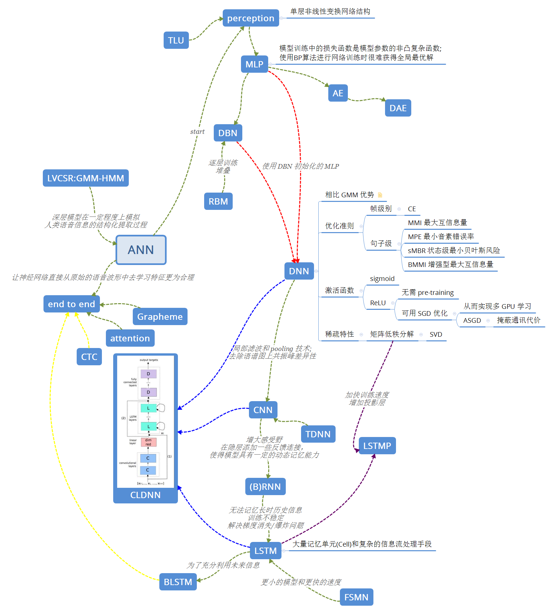
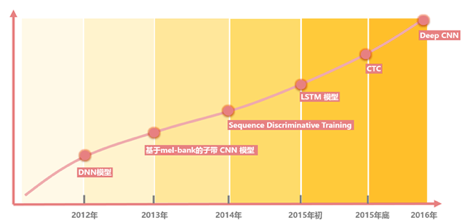
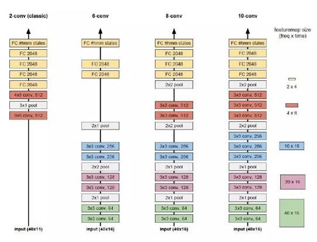
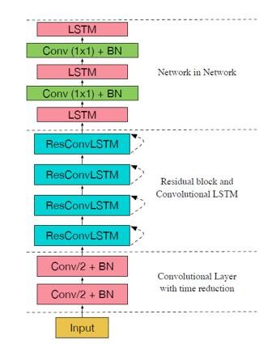
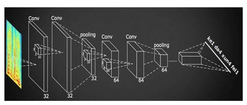

# 一段语音的艺术之旅

---

## 1 深度学习在语音识别中的应用

深层模型在一定程度上模拟人类语音信息的结构化提取过程.

- **阈值逻辑单元(Threshold logic unit, TLU)** -- 第１个人工神经元.

- **感知器(Perception)** 一般是指单层非线性变换的网络结构, 它仅对线性可分问题具有分类能力, 对于线性不可分问题只能做近似分类.

- **MLP** 是一种多层的非线性变换模型, 其具有强大的表达和建模能力. 但由于 MLP 的各层激活函数均为非线性函数, 模型训练中的损失函数是模型参数的非凸复杂函数. 并且, 随着层数的增多, 非凸目标函数越来越复杂, 局部最小值点成倍增长, 很难进行优化, 使用 BP 进行算法进行网络训练时很难获得全局最优解. 使能力无法展现.

- **自动编码器(auto encoder, AE)** 是由自动关联器演变而来的. 自动关联器是一种 MLP 结构, 其中输出、输入维度一样, 并定义输出等于输入.

- **深度自动编码器 DAE** : 由多个自动编码器堆叠而成的网络, 它属于无监督模型.

- **深度置信网络(Deep Belief Networks, DBN)** 是 Hinton 等学者在 2006 年提出的一种无监督的概率生成模型. 用 DBN 来初始化 MLP 各层的网络参数能够解决其目标函数难以优化的问题.

- **DNN**: 一般称使用DBN来初始化的MLP为DNN. DNN模型的训练阶段大致分为两个步骤：

    + **预训练(Pre-training)**: 利用无监督学习的算法来训练受限波尔兹曼机 (Restricted Boltzmann Machine, RBM), RBM通过逐层贪婪无监督预训练并堆叠成DBN；
    + **模型精细调整 (Fine-tuning)**: 在DBN的最后一层上面增加一层Softmax 层, 将其用于初始化DNN的模型参数, 然后使用带标注的数据, 利用传统神经网络的学习算法(如 BP 算法)来学习DNN的模型参数.

    1. 使用 ReLU 激活函数可使用 SGD 方法利用多 GPU 进行学习. SGD训练时必须采用小批量(mini-batch), 不同机器间的频繁交互会导致通信代价很高, 从而没法带来很大的训练速度提升.

        由于机器之间的通讯代价是并行计算的一个瓶颈, 提出**异步随机梯度下降(Asynchronous Stochastic Gradient Descent, ASGD)**, 可以有效地掩蔽通讯代价, 利用包含数千个CPU的集群来进行DNN的并行训练.

    2. DNN的稀疏特性, 根据稀疏矩阵不满秩的特性, 引入了矩阵低秩分解的方法, 将原本的DNN权重矩阵分解成两个小矩阵相乘的形式, 从而可以将网络的参数减少30% ~ 50%.

        其中一种较好的方法是利用奇异值分解**SVD(Singular Value Decompose)**对输出层矩阵进行降维, 将原始高维输出层转换为两层：一个瓶颈线性层和一个非线性输出层. 用两个小矩阵乘积作为原始大权值矩阵的近似结果, 两者都具有很小的权重矩阵, 该方法使输出层大小减少一半, 大幅度减少计算时间, 但识别率不会降低.

- **CNN**:相比于DNN, CNN通过采用**局部滤波**和**最大池化技术**可以获得更加鲁棒性的特征. 而语音信号的频谱特征也可以看做一幅图像, 每个人的发音存在很大的差异性, 例如共振峰的频带在语谱图上就存在不同. 所以**通过CNN, 有效 地去除这种差异性将有利于语音的声学建模**.

- **RNN**:无论是 CNN 还是 DBN 或 SAE, 都没有考虑样本之间的关联性, RNN通过在隐层添加一些反馈连接, 使得模型具有一定的动态记忆能力, 对长时时序动态相关性具有较好的建模能力.

    在普通 RNN 训练中, BPTT 无法解决长时依赖问题(即当前的输出与前面很长的一段序列有关, 一般超过十步就无能为力了), 因为 BPTT 会带来所谓的梯度消失或梯度爆炸问题(the vanishing/exploding gradient problem), 训练过程极不稳定,无法记忆长时历史信息. 为了解决此问题, Hochreiter 等提出 LSTM 模型结构.

- **LSTM**: 训练LSTM需要使用沿时间展开的反向传播算法(Back Propagation Through Time, BPTT)算法, 会导致训练不稳定, 而且训练相比于DNN会更加耗时.

- **LSTMP**: 将矩阵低秩分解和LSTM相结合, 称为所谓的LSTMP结构, 也可以大幅度地加快LSTM 的训练.

    为了加快训练速度, Graves 等提出在记忆单元的输出之后增加一层投影层(Projection),即带投影层的长短记忆网络 (Long Short Term Memory Projection, LSTMP) 构. 在训练过程中,LSTMP 结构以减少少量显存换取训练速度的提升,在实际应用中具有较大的实用价值.

- **前馈序列记忆网络(Reedforward Sequence Memory Networks, FSMN)**, 可以用更小的模型和更快的速度, 取得比LSTM更好的性能.

- **CLDNN**: 结合CNN, DNN以及 LSTM各自的优点, 提出了CLDNN结构用于语音的声学建模.
CLDNN 网络的通用结构是输入层是时域相关的特征, 连接几层 CNN 来减小频域变化, 使 LSTM 输入自适应性更强的特征, CNN 的输出灌入几层 LSTM 来减小时域变化, 提供长时记忆, LSTM 最后一层的输出输入到全连接 DNN 层, 目的是将特征空间映射到更容易分类的输出层, 增加隐层和输出层之间的深度获得更强的预测能力.

### 不断演化进展

- ##### 《DeepMind提出关系RNN：记忆模块RMC解决关系推理难题》》
- ##### 《ICML 2018 | 训练可解释、可压缩、高准确率的LSTM》》
- ##### 《显著超越流行长短时记忆网络, 阿里提出DFSMN语音识别声学模型》》
- ... ...

### CNN在语音识别中的应用

- #### 百度deep speech

    比较重点的进展如下：

    1. 2013 年, 基于梅尔子带的 CNN 模型;
    1. 2014年, Sequence Discriminative Training(区分度模型);
    1. 2015 年初, 基于 LSTM-HMM的语音识别 ;
    1. 2015 年底, 基于 LSTM-CTC的端对端语音识别;
    1. 2016 年, Deep CNN 模型, 目前百度正在基于 Deep CNN 开发  deep speech3, 据说训练采用大数据, 调参时有上万小时, 做产品时甚至有10 万小时.

    

    Deep Speech 2: End-to-End Speech Recognition in English and Mandarin

    

- #### IBM Deep CNN 框架

    

- #### Google's frame posted on 2017 ICASSP

    

- #### 科大讯飞DFCNN

    

## 2 汉语语言学知识

**音节是最小的发音单位, 也是听觉上能够自然辨别出来的最小语音单位.**

- **从发音机制的角度看**

       一个音节对应着喉部肌肉的一次紧张, 即肌肉紧张一次, 就形成一个音节,  紧张两次就形成两个音节. 如汉语 xian 包含的一串 **音素**, 如果发音时肌肉紧张一次, 就形成一个音节(鲜), 如果发音时肌肉紧张两次, 就形成两个音节(西安).

- **音素(Phoneme)**

    是语音的最基本组成单位; 音素组成音节(Syllable), 音节组合成词(Word).

    **从音素分析的角度来看**, 汉语 22 个声母中的 21个声母都是单辅音. 另一个为没有声母的零声母；38个韵母分别由 9 个单元音、13 个复元音和 16个复鼻尾音充当.

每个音节发音时肌肉的紧张以包括**渐强、强峰、渐弱**三个阶段.  如果把这三个阶段的对应的音分别称为**起音、领音和收音**的话, 音节的构成模式不外以下四种 ：

    (1)领音
    (2)起音+领音
    (3)领音+收音
    (4)起音+领音+收音

> 一个音节可以没有起音和收音, 但决不可以缺少领音, 没有领音就不能构成音节. 领音必须有相当的响度才能在听觉上觉察出音节的出现.

- 在汉语普通话中,一个音节由 **元音(Vowel)** 和 **辅音(Consonant)** 组成.

    汉语普通话音节基本上都具有“辅音-元音”的结构(有些特殊音节只含有元音,没有辅音,例如“阿”). 在汉语中,辅音也称为声母,元音也称为韵母.

    汉语语音中, 充当领音的经常是元音(V), 起音一般由辅音(c)充当, 收音可以是元音, 也可以是辅音, 即汉语音节结构的基本形式有 **V, VC, CV, CVC** 几种, 而不存在英语中以复辅音为起音 **(CCV, CCCV)** 或收音 **(VCC, VCCC)** 的音节结构.

- 不同于英语,汉语普通话是一种带有声调的语言.

    汉语普通话中有四种声调,它们是**阴平、阳平、上声、去声**,也称为**一声、二声、三声、四声**. 而声调与基音频率关系密切,韵母段中基音频率的变化轨迹即为声调.

    按照汉语拼音方案, **音节的结构**是以声母 (A)、韵母 (B)和声调(T)为基本元素的, 带有声调的韵母形成调母 (D), 调母由汉字音节中的韵母所载荷, 形成调母并容易为听觉感知系统所感知. 一个汉字的拼音可以表示为声母、韵母、声调和调母. 在这种结构下, 起音由声母充当、领音由调母充当, 收音包含在调母之中.

### 汉语语音识别中的识别基元有三种：**词语、音节和音素**.

在汉语语音识别研究中, 主要流行的基元选择方法有两类：其一是**以汉语拼音方案**的声母和韵母为基元(共61个)；**另一类是细化的声母和韵母模型**, 根据音节中的韵头(共有 a, o, e,  i, u,  v 六种)将声母进一步细化分类. 即将一个声母按后接不同的韵头划分为不同的类别, 同样的, 韵母在零声母音节和有声母音节中也划为不同的类别, 每个类别对应于一个基元 (共161个).

在经常使用的 6000 多个汉字中, 总共只有 1281 个汉字音节. 若不考虑汉语中的声调（阴平、阳平、上声、去声）, 汉语中约有 408 个无调音节.

由于音节是人类听觉所能感受到的、能够区分清楚的、最小的语音单元, 并且是音义相结合的基本语言单位, 因此, 音节在汉语语音识别中无疑是最佳的基元选择方案, 同时也是汉语孤立词及小词汇量语音识别系统中一直使用的方法.

在中、大词汇量连续汉语语音识别系统中, 由于识别汉字量的增加, 以音节为识别基元会增大识别系统的字典和训练过程. 因此, 为了简化字典和训练过程提高识别率, 一般选择比音节更小的语音单元：声母、韵母等半音节基元（共 61 个）或者更小的音素作为识别基元.

### 声韵母补充知识

声母是指使用在韵母前面的辅音. 从表中可以看出汉语音素中总共有 24 个辅音.

韵母的位置是在汉语音节中位于声母之后, 在这其中也有直接以韵母开头的音节. 通常情况下**汉语韵母由元音和辅音两部分组成, 这里的韵母应该至少应包含一个元音**. 韵母还可以分为韵头、韵腹和韵尾三部分.

## 3 汉语语音识别模型

**第一种为基于字结构的识别系统**,它可以细化为三级(层)处理结构.第一层为声学层(底层识别), 这一层仅仅考虑408个无调的音节的识别. 使用N-best算法获取前N个最好的候选音节. 第二层为拼音Trigram语言模型(中层识别).它利用了拼音间的统计信息, 进行基于拼音串的语言理解,其后进行音调识别, 给出对应的拼音串四声似然度估值. 第三层为音字转换(上层识别). 该级将根据字典把有调的不同长度多候选的拼音串转换成相应词格网络图,  该网络包含了从底层传送上来的词先后顺序关系, 以及对应语音发音模型的似然信息、词性Trigram信息等等. 最后, 通过Viterbi找出最可能的汉字串. 分级处理的系统要保证识别过程整体测度一致性.

**第二种为基于词结构的识别系统**, 它可以细化为二级(层)处理结构. 它也是一种比较典型的英语语音识别系统, 可以直接把这种词结构的英文语音识别系统直接用于汉语语音的识别 . 首先把几万个常用汉语词汇直接生成底层词树, 识别的结果可以是句子也可以是具有一定结构的多候选词格网络.

### 端到端汉语语音识别模型

> DLSTMP, 在这项工作中, 我们试图为中文普通话建立一个端到端的语音识别系统. 该系统基于 LSTMP 网络和 CTC 目标函数的组合. 汉字被直接用作输出标签. 端到端系统中的 LSTMP 模型输出层有 6,725 个单元(中文字符集为 6,724 个单位, “空白” 符号为 1 个).

## 4 未来工作 -- AISHELL-2 中文语音数据库

### 数据集介绍

希尔贝壳中文普通话语音数据库 AISHELL-2 的语音时长为 1000 小时，其中 718 小时来自 AISHELL-ASR0009-[ZH-CN]，282 小时来自 AISHELL-ASR0010-[ZH-CN]。

录音文本涉及**唤醒词、语音控制词、智能家居、无人驾驶、工业生产等 12 个领域**。

录制过程在安静室内环境中，同时使用 3 种不同设备：

    高保真麦克风（44.1kHz，16bit）
    Android 系统手机（16kHz，16bit）
    iOS 系统手机（16kHz，16bit）

AISHELL-2 采用 iOS 系统手机录制的语音数据。

1991 名来自中国不同口音区域的发言人参与录制。经过专业语音校对人员转写标注，并通过严格质量检验，此数据库文本正确率在 96% 以上。

### 工作计划

先在 AISHELL-1 数据集和相应代码平台上学习, 研究其框架和实现脚本.

> 希尔贝壳中文普通话开源语音数据库 AISHELL-ASR0009-OS1 录音时长 178 小时.

后续实现定制化的 ASR 平台.

## 5 传统识别方法 -- GMM+HMM

### MFCC

### 孤立词识别

### 大词汇量语音识别

### 二十年的成长

- 上下文有关模型
- 区分式训练
- 说话人适应
- 二次打分

`虽然以现在的思维难以去理解未来的领域发展, 但相信一定会出现某种语音特征或处理方式, 它既不借助于图像, 也无需复杂的数学理论和消耗众多的硬件资源, 回归到语音原始层面, 甚至脱离波形的约束, 而实现超越人脑的处理能力.`

### 新旧系统框架对比

### 评价指标:词错误率

